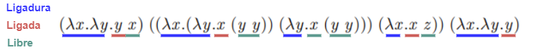
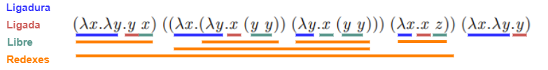

# Práctico 4

## 1

### a)

### b)

$\beta$-redexes

### c)

Por el corolario del teorema de Church-Rosser el termino tiene una única forma normal.

### d)

Primer termino:

- $\lambda x.\lambda y.y~x \rightarrow_\beta \lambda y.y$

> $(\lambda y.y)~[x := x] = \lambda y.y$

Segundo termino:

Primera parte:

- $\lambda x.(\lambda y.x~(y~y))~(\lambda y.x~(y~y))
\rightarrow_\beta \lambda z.(\lambda y.x~(y~y))~(y~y)$

> $(\lambda y.x~(y~y))~[x := \lambda y.x~(y~y)]
= \lambda z.(\lambda y.x~(y~y))~(y~y)$

- $\lambda z.(\lambda y.x~(y~y))~(y~y) \rightarrow_\beta \lambda y.x~(y~y)$

> $(\lambda y.x~(y~y))~[z := (y~y)] = \lambda y.x~(y~y)$

- $\lambda y.x~(y~y) \rightarrow_\beta x$

> $x~[y := (y~y)] = x$

Segunda parte:

- $\lambda x.x~z \rightarrow_\beta z$

> $x~[x := z] = z$

Ahora:

- $(\lambda y.y)~(x~z) \rightarrow_\beta (x~z)$

> $(y~[y := (x~z)]) = (x~z)$

El tercer termino no se puede reducir, por lo tanto el resultado es:

- $(x~z) (\lambda x \lambda y . y)$

## 2

$Pair ~a ~b = \forall \alpha .~(a \rightarrow b \rightarrow \alpha) 
\rightarrow \alpha$

$Nat = \forall \alpha .~(\alpha \rightarrow \alpha) \rightarrow 
\alpha \rightarrow \alpha$

### a)

$SWAP ~: ~Pair ~a ~b \rightarrow Pair ~b ~a$

$SWAP = \lambda p^{Pair ~a ~b}. ~PAIR ~(SND ~p) ~(FST ~p)$

### b)

$DUP~ : ~Nat \rightarrow ~Nat$

$DUP = \lambda n^{Nat} . ~foldN ~Nat ~S ~n ~n$

### c)

$EXP2 ~: ~Nat \rightarrow ~Nat$

$EXP2 = \lambda n^{Nat} . ~foldN ~Nat ~(PLUS ~n) ~Z ~n$

### d)

$PRED ~: ~Nat \rightarrow ~Nat$

$PRED = \lambda n^{Nat} . ~foldN ~Nat ~(\lambda m^{Nat}. ~IF\_THEN\_ELSE ~Nat$

Se puede hacer pattern matching sobre S n así nomas con lambda? NO

Hay que hacer todo un metodo raro creando un par y poniendo una función delante
de la otra, [ver acá](https://gist.github.com/Sam-Serpoosh/30c558900df69291ff35128c1fe3b886).

## 3

$fix ~f = f ~(fix ~f)$

Mal:

$suma ~: ~Nat \rightarrow ~Nat$

$suma = fix ~(\lambda f. \lambda n^{Nat} . ~IF\_THEN\_ELSE ~Nat ~(ISZERO ~n) ~Z
~(PLUS ~n ~(f ~(PRED ~n)))$

Hay que hacer código haskell.

## Presentación

Introducción muy abstracta y corta de blockchain o dar la mirada desde otro lado.
Hablar de un smart contract y vincular con Plutus, hablar de las caracteristicas,
las mónadas ox que tienen, qué es lo especial que tiene. O quizá hablando el
problema y porqué se eligió programación funcional para el lenguaje de los contratos.

Plutus es muy parecido a haskell por lo tanto no hay que explicarlo tanto.

Charlas que presenta la gente, Chacrabarsky, Tompson, abstractas.
IOHK -> articulos.
https://docs.cardano.org/plutus/learn-about-plutus

NO intentar programar un smart contract.
https://iohk.io/en/research/library/papers/functional-blockchain-contracts/
